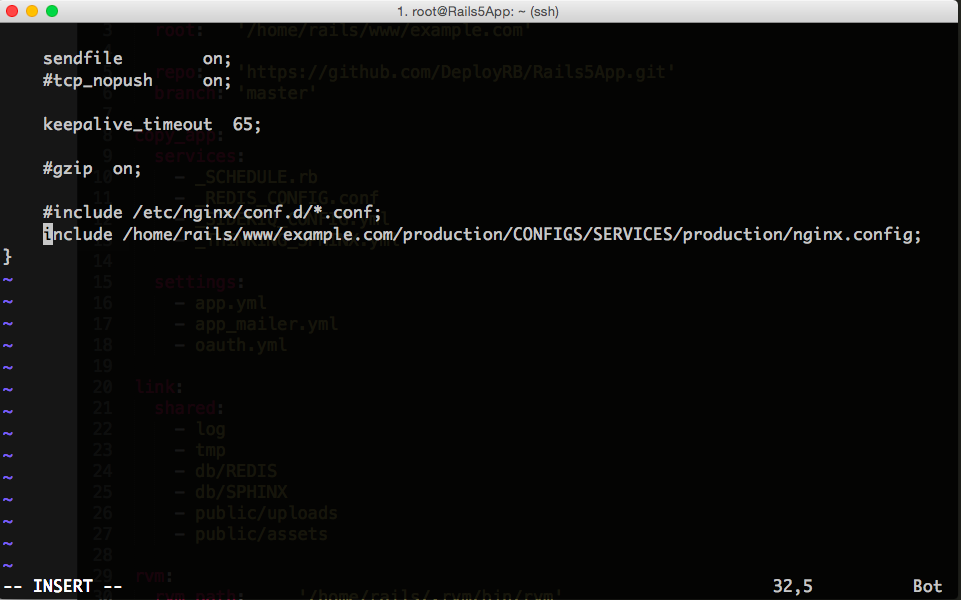
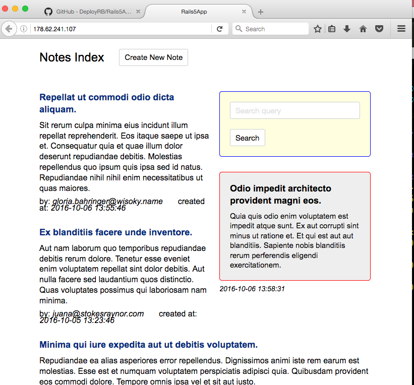

## Deploy.RB / Deploy Tool

This is a part of the [Deploy.RB](https://deployrb.github.io/) project.

Deploy.RB consists of:

1. [Rails 5 App](https://github.com/DeployRB/Rails5App)
2. [Server Installation Script & Manual](https://github.com/DeployRB/SetupServer)
3. [Deployment Tool](https://github.com/DeployRB/DeployTool) (**You are here**)

Please, visit [Deploy.RB](https://deployrb.github.io/) page to get more information.

```
```

# Deploy Tool

Simple but effective Deploy Tool is written in Ruby in procedure-oriented style.

This tool is a good choice for simple projects based on the just server and for education & demonstrative purposes.

## Deploy of an example project "Rails 5 App"

<details>
  <summary>How to deploy Rails 5 App</summary>

### 1. Clone the Deploy Tool and install gems

```sh
git clone https://github.com/DeployRB/DeployTool.git
cd DeployTool

gem install bundler
bundle install
```

### 2. Copy templates & config files

```sh
cp -Rv __TEMPLATES__/production.example __TEMPLATES__/production

cp -Rv __ENV__/production.example __ENV__/production
```

### 3. Set up access parameters in `server_access.yml` config file

EDIT: `__ENV__/production/server_access.yml`

### 4. Check and Edit important templates & config files

EDIT: `__ENV__/production/database.yml`

EDIT: `__ENV__/production/deploy_params.yml`

EDIT: `__TEMPLATES__/production/settings/app.yml`

### 5. Deploy!

```sh
DEPLOY_ENV=production ruby deploy.rb
```
### 6. Edit `NginX` config file

Run command. This command will show you an address of `NginX` config files

```sh
DEPLOY_ENV=production ruby deploy.rb nginx_info
```

Go to the server and edit:

```sh
ssh root@257.123.45.67

edit /etc/nginx/nginx.conf
```

Add the line with `include PATH/TO/NGINX/CONFIG`

<details>
  <summary>See example image</summary>
  
</details>

Save and Exit

### 7. Restart NginX

```sh
DEPLOY_ENV=production ruby deploy.rb nginx_restart
```

### 8. Run `rake` task on the server

```sh
DEPLOY_ENV=production ruby deploy.rb rake_task

db:seed
```

### 9. Visit the App by IP or Domain name

<details>
  <summary>See example image</summary>
  
</details>

</details>

## How does Deploy Tool work?

The Entry point of the project is method `deploy!` in file [kit/rails/deploy.rb](kit/rails/deploy.rb)

Method `deploy!` looks like this:

```ruby
  def deploy!
    startup_authorize_deployer
    startup_create_base_dirs
    startup_copy_ssh_files

    ...

    app_bundle

    app_database_create
    app_database_migrate
    app_assets_precompile

    link_current_release

    puma_restart
    release_cleanup
  end
```

To run this method you can use the following command:

```ruby
DEPLOY_ENV=production ruby deploy.rb deploy!
```

Method `deploy!` provides deployment process in procedure-like style. You will not find here `after` and `before` hooks. Everything is just a set of ruby methods. You can manage an order of an execution of the methods manually.

You can use `binding.pry` to stop a deployment process at any point if you want to check what specific method does.

This project uses really simple approaches and code base. You can learn how it works in minutes!

## Project's stucture

```ruby
├── __ENV__
│   ├── production
│   │   ├── database.yml
│   │   ├── deploy_params.yml
│   │   └── ssh_ssl.yml
├── __TEMPLATES__
│   ├── production
│   │   ├── database.yml
│   │   ├── services
│   │   ├── settings
│   │   └── ssh_ssl
├── deploy.rb
└── kit
    ├── base
    ├── common
    ├── custom
    ├── kit.rb
    └── rails
```

* `deploy.rb` main entry point of Deploy Tool
* `__ENV__` Settings for Deploy Tool for a specific Environment
* `__TEMPLATES__` Templates to configure external services (DB (database.yml), Redis, Sidekiq, Thinkig Sphinx, etc.)
* `kit` folder with methods to provide a deployment process
* `kit/base` common methods to provide a deployment process
* `kit/rails` methods to provide a deployment process for Rails app

## Execution of specific methods

To execute specific a method you can use the following way:

```ruby
DEPLOY_ENV=ENVIRONMENT ruby deploy.rb METHOD_NAME
```

where `ENVIRONMENT` is a name of a required environment (`development` by default)

where `METHOD_NAME` is a name of a required method to execute (`deploy!` by default)

## Additional params

**Deploy debugging**

`DEPLOY_DEBUG=true` will run a method, but `ssh` calls will not be executed

**Specific release directory**

`DEPLOY_DIR=DIRECTORY_NAME` will run a method inside a specific `release folder`. The list of the folders of releases you will find in the file `RELEASES.txt` which will be created right after a first deploy.

This option can be helpful if you want to update the code of an existed release, but don't want to re-deploy all the project.

```ruby
DEPLOY_ENV=production DEPLOY_DIR=2016-10-03--23-33-14--master ruby deploy.rb deploy_backend_changes!
```
