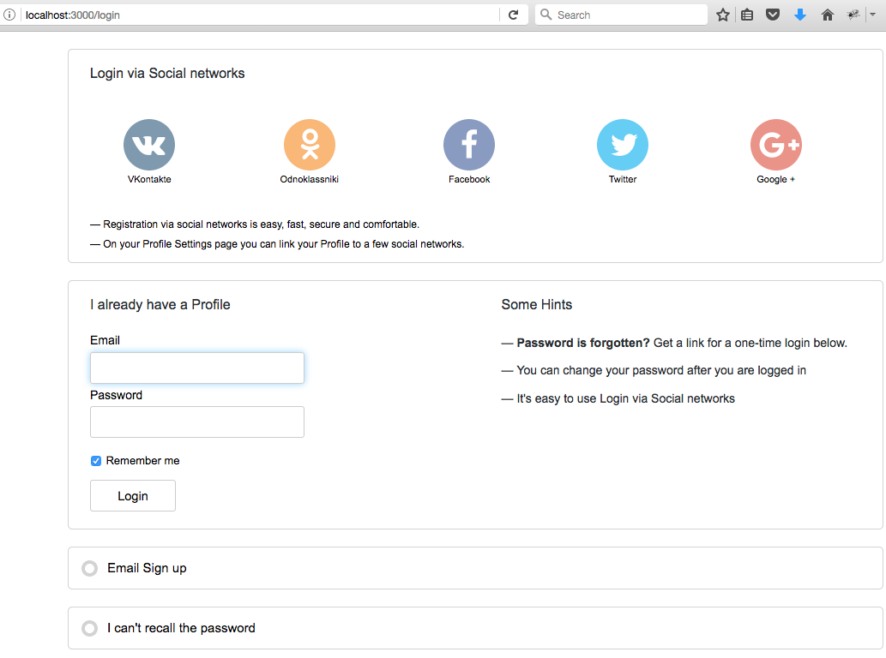

[&larr; Docs](./README)

```
```

# TheOpenCMS weekly report

### Week 2

Hello World!

Content is Everything!

A week ago I've started to make my own CMS project on Rails 5.

Why do I do that? I believe - Content is Everything! And we (developers, community) have to provide a diversity of CMS projects on the Web. Unfortunately, I've noticed that Rails eco-system doesn't have enough CMS projects. All great developers are concentrated on something else, and many people around think that a CMS is something what easy to create and it doesn't worth to pay an attention to this area. I'll try to change something.

I'm going to create my CMS based on [Rails Engines](http://guides.rubyonrails.org/engines.html). First of all I have to create an Engine for a user's profile. This engine will provide Sign in and Login process, some user's profile staff like avatar uploading, a profile's edit page and so on.

On this week I've done the following things:

- [x] Cleaned up the code of the [user_room](https://github.com/TheOpenCMS/user_room) gem
- [x] Added some docs in the [Docs](./) folder
- [x] Added translation files and provided `I18n` for [user_room](https://github.com/TheOpenCMS/user_room) gem
- [x] [Sprockets](https://github.com/rails/sprockets-rails) didn't compile my Engine's assets as they have to. I found a solution. Just use a code form they current *mater* branch.
- [x] The first page of [user_room](https://github.com/TheOpenCMS/user_room) gem started to work. Now it looks so:

  

### Week 1

Hello World! Content is Everything!

This week I've decided to create a new CMS on Rails 5. Actually I already have some code drafts and ideas about how my CMS has to work, and I think this time I'll reach my goal.

First of all I had to decide how I would split my CMS into the parts and how I would manage all this staff.

I choose `git subtrees` to manage dependencies in my project. With subtrees I can keep all the code in a one place and I will manage the only one repo, however I can update each dependance separately. I was confused with `--squash` option on the `git subtree pull` command. I don't like how this option works. And that's why I will not use it.

I've created a small ruby script to work with subtree commands. During the development process I do something like this:

```ruby
ruby SUBTREES/subtree.rb add  the_open_cms

ruby SUBTREES/subtree.rb pull the_open_cms

ruby SUBTREES/subtree.rb push the_open_cms
```

With these commands I can `add`, `pull`, `push` all dependencies at the same time. Right now it works fine for me.

#### Gems were published

This week I've already published a few small but helpful gems. They will be used when I'll be implementing User's cabinet. There is the list of these gems:

* `voiceless` very small [gem](https://github.com/TheOpenCMS/voiceless) helps split system in to the parts.
* `log_js` very small [gem](https://github.com/TheOpenCMS/log_js) provides a shortcut method `log` for method `console.log`.
* `pagination` very small [gem](https://github.com/TheOpenCMS/pagination) provides a helper for Kaminari pagination.
* `simple_sort` small [gem](https://github.com/TheOpenCMS/simple_sort) provides a few sort helpers for AR models.
* `image_tools` small [gem](https://github.com/TheOpenCMS/image_tools) provides a few helpers for image manipulations.
* `crop_tool` small [gem](https://github.com/TheOpenCMS/crop_tool) provides a crop tool for Images.
* `notifications` small [gem](https://github.com/TheOpenCMS/notifications) provides a helper to show flash notifications in a Rails app.

#### Goals

My first goal is to create a user's cabinet (user registration & user profile). On the first step I will implement signing by email and most popular social networks. Also I have to implement avatars' uploading and maybe some email notifications. Not sure right now. We will see.

#### Current status

The app still doesn't work. There are a lot of things to do, but I know what I have to finish to make it alive. Wish me good luck :)

TheOpenCMS. Content is Everything!
See you next week!
