[&larr; Docs](./README.md)

```
```

# TheOpenCMS weekly report

## Week 5

Hello World!

Content is Everything!

On this week I've done the following things:

* Login via Social Networks was debugged. Works fine.
* User can connect multiple Social Accounts to own Profile
* I've described how to get OAuth tokens for some social networks. [New page](./SocialNetworksOAuth.md) was added in `docs` folder.
* Index/Show pages for `Users` controller were improved
* Some improvements were done
* File structure of the project was changed

**Login via Social Networks**

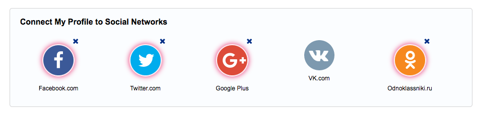

**Index/Show pages**

<table>
  <tr>
    <td>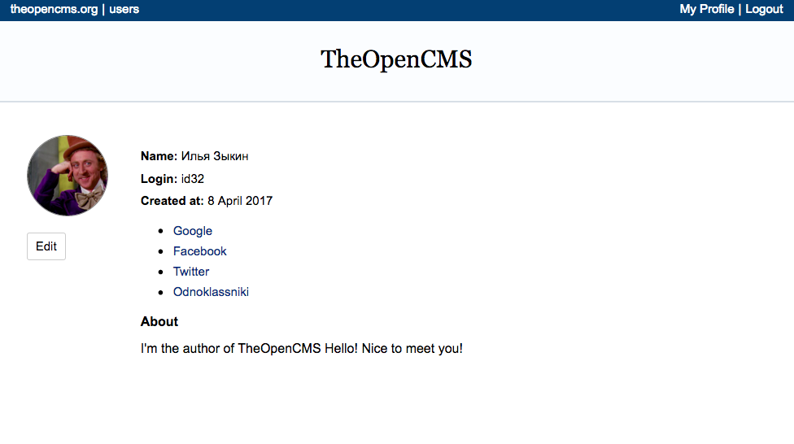</td>
    <td>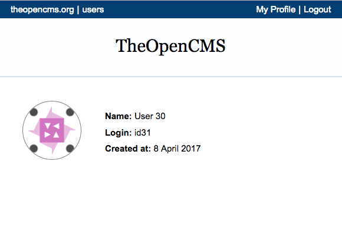</td>
  </tr>
</table>

**Plans for the next week**

I'm going to setup a server and launch the project.

**How to help**

* Feel free to give a star to [the project](https://github.com/TheOpenCMS/TheOpenCMS). Your support is very important
* It's always possible to improve localization and improve current translations.

TheOpenCMS. Content is Everything!

See you next week!

## Week 4

Hello World!

Content is Everything!

On this week I improved `gem 'user_room'`. Now gem provides all basic actions. User is able to sign in/login, update profile's data, and to see a list of users.

There is a basic user's story with screenshots:

**User**

* is able to Sign in/Login in the system with email
* receives an email with activation link or a one-time login link
* sees a user's profile
* is able to update a profile's data: Name, Login, About, Social Networks addresses, etc.
* uploads and crops an avatar image
* is able to see a list of users

<table>
  <tr>
    <td>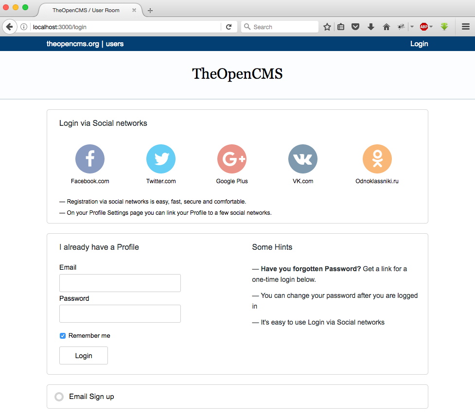</td>
    <td>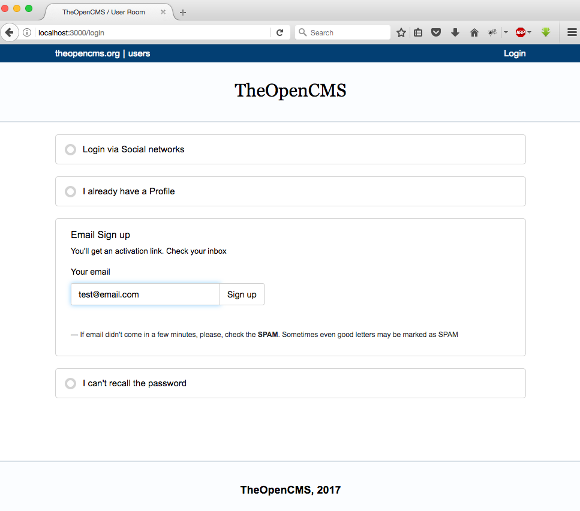</td>
    <td>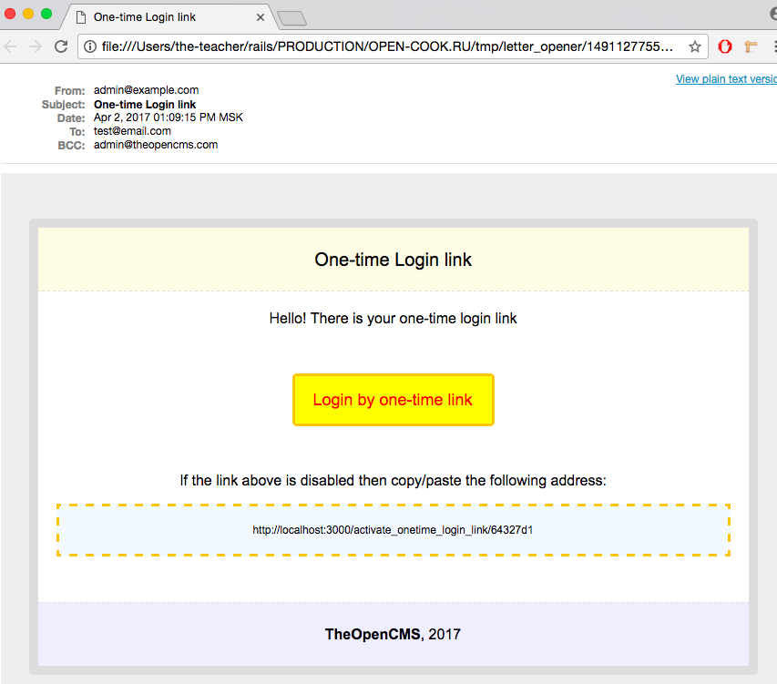</td>
  </tr>

  <tr>
    <td>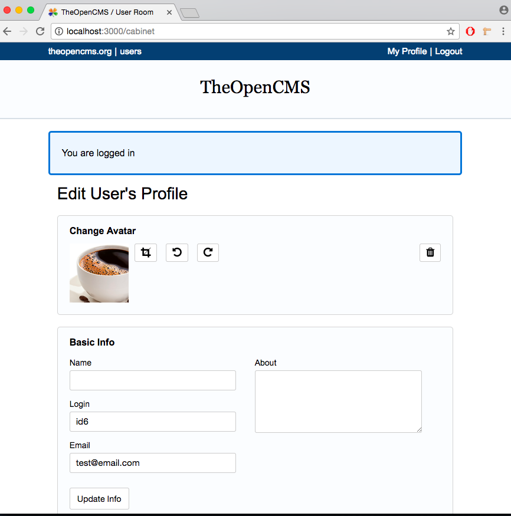</td>
    <td>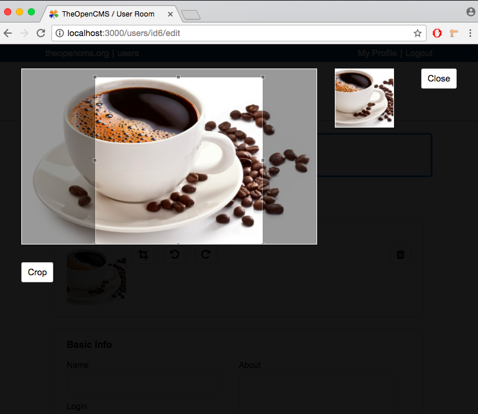</td>
    <td>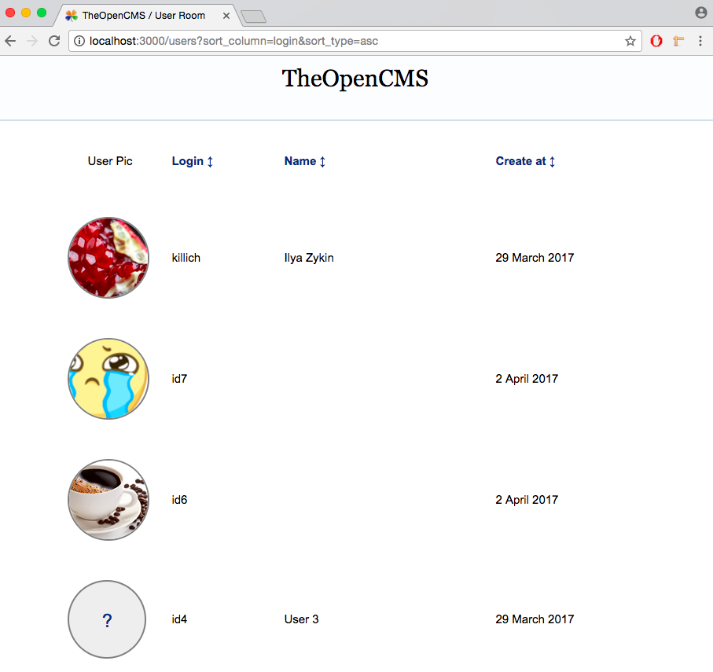</td>
  </tr>
</table>

**Plans for the next week**

* I'm going to start debugging `Login via Social Networks` workflow.

**How to help**

* Feel free to give a star to [the project](https://github.com/TheOpenCMS/TheOpenCMS). Your support is very important
* It's always possible to improve localization and improve current translations.

TheOpenCMS. Content is Everything!

See you next week!

P.S.: Btw, I've bought already a domain name `theopencms.org`. I'm going to start a web site soon(...ish).

## Week 3

Hello World!

Content is Everything!

First of all I want to say Thank you to people who already supported the project with their stars. Your stars are very important!

During this week I was working on improvements for a few parts of the project.

[notifications](https://github.com/TheOpenCMS/notifications) gem was improved, but it still needs for some improvements. I'll do it later when I meet a real cases and problems.

There are some screenshots how gem [notifications](https://github.com/TheOpenCMS/notifications) renders notifications:

<table>
  <tr>
    <td>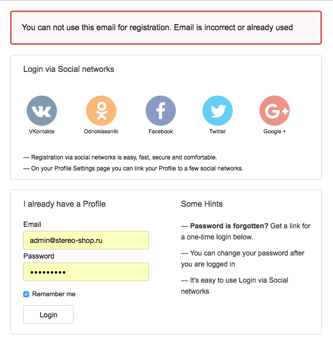</td>
    <td>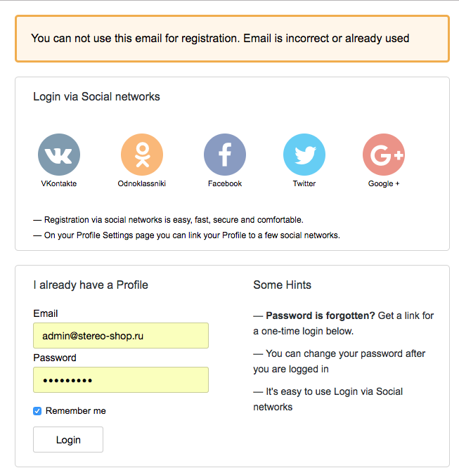</td>
    <td>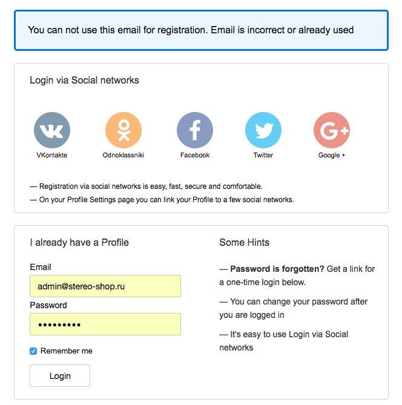</td>
  </tr>
</table>

Most of the time I was working on gem [user_room](https://github.com/TheOpenCMS/user_room). I improved localizations, mailer, mailer's templates.

There are some examples how mailer's templates look

<table>
  <tr>
    <td>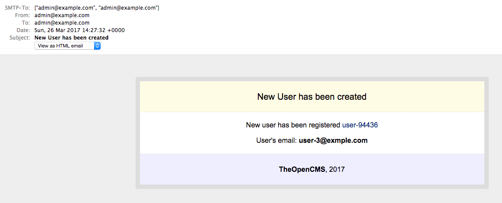</td>
    <td>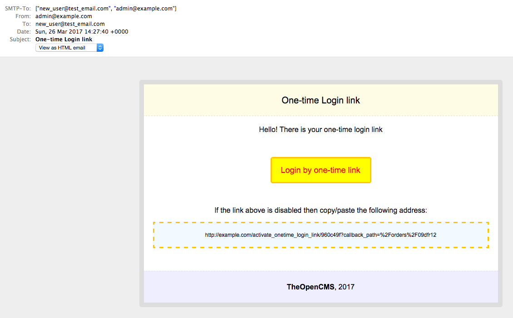</td>
    <td>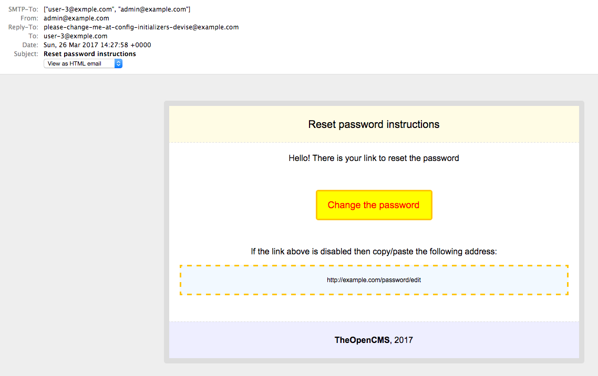</td>
    <td>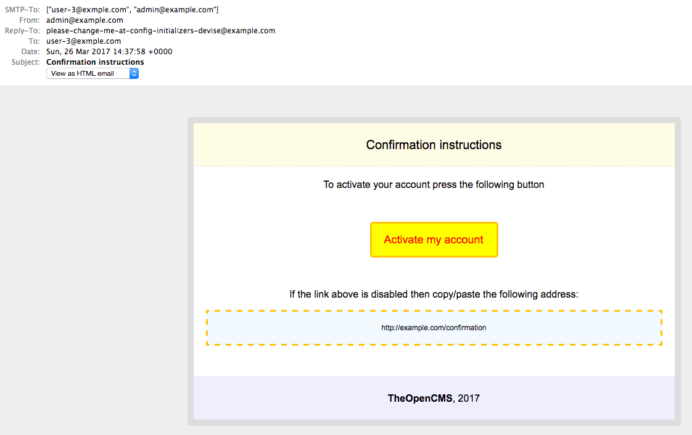</td>
  </tr>
</table>

I collected all the mailer's staff (`css`, `mailer's classes`, `templates`) in the only folder [app/mailers](https://github.com/TheOpenCMS/TheOpenCMS/tree/master/SUBTREES/TheOpenCMS/user_room/app/mailers). If you are interested how I've done it you may check [this file](https://github.com/TheOpenCMS/user_room/blob/master/lib/user_room.rb#L36)

Also small gem [log-js](https://github.com/TheOpenCMS/log_js) was improved.

Also I was playing with `Turbolinks`. I'm going to use it later, but right now I don't have enough cases to use it somehow.

I've created a channel in gitter.im - [gitter.im/the_open_cms](https://gitter.im/the_open_cms/main). Feel free to ask anything about the project TheOpenCMS.

**Plans for the next week**

* I'm going to start debugging Login/Sign-in workflows.

**How to help**

* Feel free to give a star to [the project](https://github.com/TheOpenCMS/TheOpenCMS) to show you interest to this initiative.
* You can take a look at localizations files. I'm not a native speaker and I'm sure there are a lot of things to improve.
* Feel free to ask me about the project in the new channel [gitter.im/the_open_cms](https://gitter.im/the_open_cms/main)

TheOpenCMS. Content is Everything!

See you next week!

## Week 2

Hello World!

Content is Everything!

A week ago I've started to make my own CMS project on Rails 5.

Why do I do that? I believe - Content is Everything! And we (developers, community) have to provide a diversity of CMS projects on the Web. Unfortunately, I've noticed that Rails eco-system doesn't have enough CMS projects. All great developers are concentrated on something else, and many people around think that a CMS is something what easy to create and it doesn't worth to pay an attention to this area. I'll try to change something.

I'm going to create my CMS based on [Rails Engines](http://guides.rubyonrails.org/engines.html). First of all I have to create an Engine for a user's profile. This engine will provide Sign in and Login process, some user's profile staff like avatar uploading, a profile's edit page and so on.

On this week I've done the following things:

- [x] Cleaned up the code of the [user_room](https://github.com/TheOpenCMS/user_room) gem
- [x] Added some docs in the [Docs](./) folder
- [x] Added translation files and provided `I18n` for [user_room](https://github.com/TheOpenCMS/user_room) gem
- [x] [Sprockets](https://github.com/rails/sprockets-rails) didn't compile my Engine's assets as they have to. I found a solution. Just use a code from the current *mater* branch.
- [x] The first page of [user_room](https://github.com/TheOpenCMS/user_room) gem started to work. Now it looks so:

  

**Plans for the next week**

- I'm going to proceed making improvements for [user_room](https://github.com/TheOpenCMS/user_room) gem. It will take some time to make it work properly
- I have to improve gem [notifications](https://github.com/TheOpenCMS/notifications) and to make it work properly with `user_room` gem

**How to help**

- If you want to help you can try to improve translation files for `user_room` gem [locale files](https://github.com/TheOpenCMS/user_room/tree/master/config/locales)
- Fell free to give a star to the project [TheOpenCMS](https://github.com/TheOpenCMS/TheOpenCMS)

TheOpenCMS. Content is Everything!

See you next week!

## Week 1

Hello World! Content is Everything!

This week I've decided to create a new CMS on Rails 5. Actually I already have some code drafts and ideas about how my CMS has to work, and I think this time I'll reach my goal.

First of all I had to decide how I would split my CMS into the parts and how I would manage all this staff.

I choose `git subtrees` to manage dependencies in my project. With subtrees I can keep all the code in a one place and I will manage the only one repo, however I can update each dependance separately. I was confused with `--squash` option on the `git subtree pull` command. I don't like how this option works. And that's why I will not use it.

I've created a small ruby script to work with subtree commands. During the development process I do something like this:

```ruby
ruby SUBTREES/subtree.rb add  the_open_cms

ruby SUBTREES/subtree.rb pull the_open_cms

ruby SUBTREES/subtree.rb push the_open_cms
```

With these commands I can `add`, `pull`, `push` all dependencies at the same time. Right now it works fine for me.

#### Gems were published

This week I've already published a few small but helpful gems. They will be used when I'll be implementing User's cabinet. There is the list of these gems:

* `voiceless` very small [gem](https://github.com/TheOpenCMS/voiceless) helps split system in to the parts.
* `log_js` very small [gem](https://github.com/TheOpenCMS/log_js) provides a shortcut method `log` for method `console.log`.
* `pagination` very small [gem](https://github.com/TheOpenCMS/pagination) provides a helper for Kaminari pagination.
* `simple_sort` small [gem](https://github.com/TheOpenCMS/simple_sort) provides a few sort helpers for AR models.
* `image_tools` small [gem](https://github.com/TheOpenCMS/image_tools) provides a few helpers for image manipulations.
* `crop_tool` small [gem](https://github.com/TheOpenCMS/crop_tool) provides a crop tool for Images.
* `notifications` small [gem](https://github.com/TheOpenCMS/notifications) provides a helper to show flash notifications in a Rails app.

#### Goals

My first goal is to create a user's cabinet (user registration & user profile). On the first step I will implement signing by email and most popular social networks. Also I have to implement avatars' uploading and maybe some email notifications. Not sure right now. We will see.

#### Current status

The app still doesn't work. There are a lot of things to do, but I know what I have to finish to make it alive. Wish me good luck :)

TheOpenCMS. Content is Everything!

See you next week!
